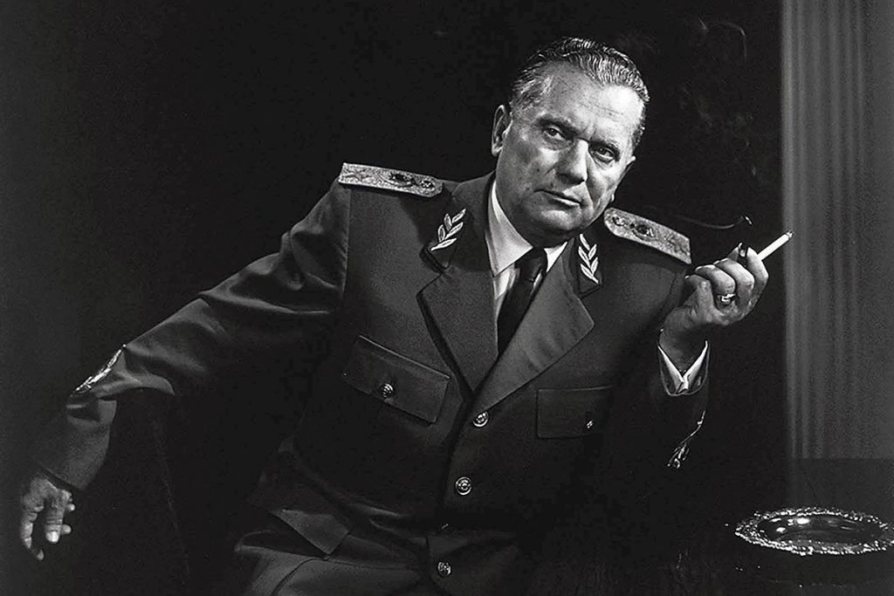
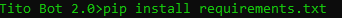

# Tito Bot

---

## What is Tito Bot?

Tito bot is a simple discord bot with various commands. Tito bot has db functionalities that include a levelling system and an economy system. It also has moderation, voice, fun and social commands.
Tito bot was made with python's discord.py rewrite library and it uses MongoDB as database.

### Bot Invite:

Im currently hosting the bot on heroku. The bot is on 24/7 but some days could be offline for no free hours.
If you want to invite it:
[Invite the bot](https://discord.com/oauth2/authorize?client_id=740866037645443134&scope=bot&permissions=1174528)

## Hosting tutorial:

---

### How to host the bot?

First of all, install all the libraries needed to execute bot.py:

Go to the terminal and type: 

> cd "directory in which the bot is installed."

> pip install requirements.txt

After that:

Go to token.txt and replace the text with your bot token.

Create a mongoDB database, and replace the text in connection_string.txt with your mongoDB database connection string.
In the database create a levels, prefixes, money and status collections.

After that, simply run the bot.py script. If something is not working feel free to ask.

## Command List:

Bot prefix: . , but it can be changed

[] = required parameters.
() = optional parameters.

### Various Commands: 

---

.getprefix

Returns the actual prefix in the server. You can change it with the next command.

---

.changeprefix [new prefix]

You change the prefix in the server, and you specify a new one to use.

---

.ping

Returns the bot latency

---

.members

Returns the number of members in the server.

---

.serverinfo

Returns info about the server youre currently in.

---

.userinfo [user]

Returns info about a specific user

---

.info/bot-info

Get info about the bot and the dev of the bot

---

.invite

Returns the bot invite, to invite tito to your server.

---

### Money/ Level Commands:

---

.level

Shows your level in the server

To increase your xp, just write in text chats
And then your level will increase.

---

.balance (user)
Shows how many money you have.

---

.work
Work to gain money.

---

.beg
Beg for money. You can get money, but its not sure

---

.crime
Commit crime, you have low probability of getting money and yugoslav police can fine you.

---

.give [user] [amount]
Gives an amount of money to an user.

---

.shop
Shows the shop of tech squad bot. Cool things to buy.

---

.rob [user]
Steals the money from an user.

---

.buy [item]
Buys an item in the shop.

---

.status
Show if your tito bot status is premium or standard. To buy the premium status, go in the shop and buy it.

---

### Moderation Commands:

---

.kick [user]

The bot kicks the specified user.

---

.ban [user]

The bot bans the specified user.

---

.unban [user]

The bot unbans the specified user.

---

.clear [number of messages]

The bot clears the specified number of messages

---

.changenickname [user] [new nickname]

The bot clears the specified number of messages

---

### Fun Commands:

---

.suicide

If youre sad you can kill yourself with the suicide command

---

.kill [user] (reason)

Kills an user.

---

.coinflip [choice]

Play coinflip.

---

.shot

Drink a shot of vodka like true slav!

---

.howchad [user]

You see how chad a user is. If he is a chad he is a true yugoslav, cuz yugoslav is chad.

---

.howdeserterska [user]

Check if the user likes tito. If he is a deserterska send him to goli otok!

---

.dance

Dance if you're happy cuz yugoslavia reunited.

---

.beep

Returns boop!

---

.kiss [user]

You kiss an user!

---

### Voice Commands: 

---

.join 

The bot joins a voice channel

---

.leave

The bot leaves a voice channel

---

.play [url]

The bot plays some music.

---

.pause

The bot pauses the music

---

.resume

The bot resumes the music.

---

.stop

The bot stops the music.

---

.volume [value]

The bot highers or lowers the volume of the music.

---

### Img commands:

---

.randomfox 

Picture of random fox

---

.randomdog

Picture of random dog.

---

